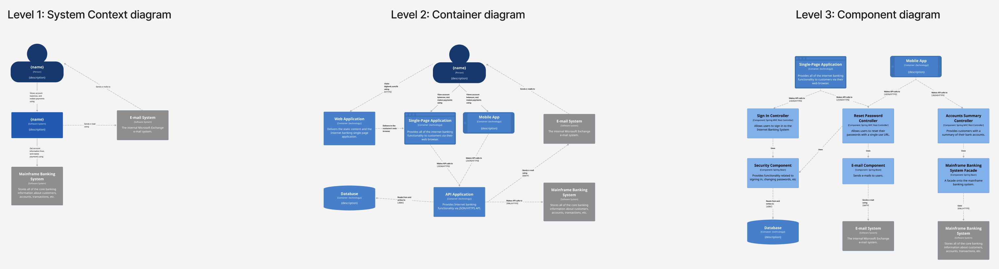
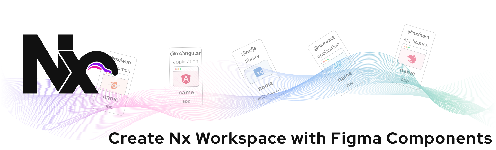
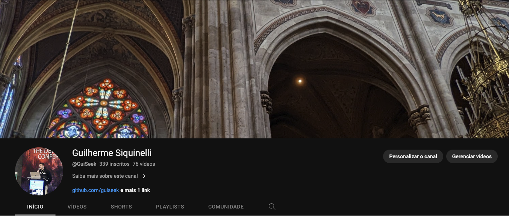
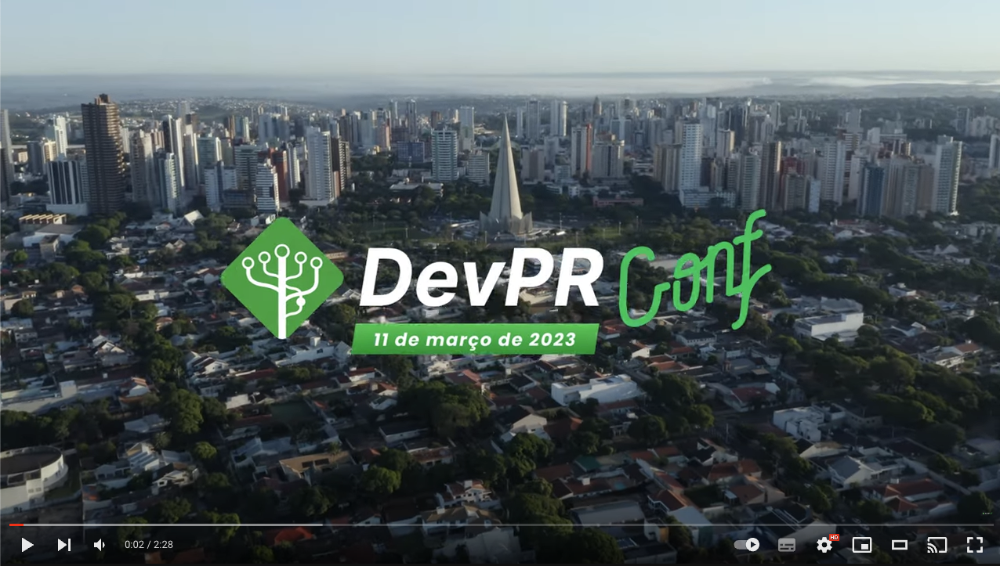

## Opa, edaee 👋 👨

### Eu sou e estou
1. Arquiteto Web @ Santander
2. Professor / Orientador / Formador
3. Organizador da DevParaná Conference
4. Sempre em busca do máximo para a Web
5. Curioso pelo universo que nos circunda

**Links**:
- [Conteúdo no Notion](https://guiseek.notion.site)
- [Conteúdo no YouTube](https://www.youtube.com/@guiseek)
- [Conteúdo no Dev.to](https://dev.to/guiseek)
- [Eurotrip em 2022](https://guiseek.github.io/photos/)
- [Perfil no Linked In](https://www.linkedin.com/in/guilherme-siquinelli/)
- [Perfil no Twitter](https://x.com/guiseek)
- [DevPR das antiga](https://guiseek.dev)

 

## Arquitetura

- [Dev](https://github.com/guiseek/dev) (POC) Arquitetura em camadas e geradores de CRUD 100% funcionais com código de qualidade
- [Nx Clean](https://github.com/guiseek/nx-clean) (POC) para compartilhamento de código de forma agnóstica a frameworks
- [Domain Event Driven](https://github.com/guiseek/domain-event-driven): (POC) de arquitetura orientada a eventos no front-end.
- [Dev Exp](https://github.com/guiseek/devexp): CRUDs a partir de um array de strings.

### Fora da caixa
- [TSX vanilla](https://github.com/guiseek/photos): Projeto para apresentar fotos escrito em TSX com typescript puro
- [Web Navigation](https://github.com/guiseek/router): Implementação de um router web usando a nova Web API com suporte nativo em navegadores
- [Barcode API](https://github.com/guiseek/barcode): Leitura de código de barras e QRCode usando Web API nativa
- [Nx Figma Plugin](https://github.com/guiseek/create-nx-workspace-with-figma): Plugin para criação de repositórios Nx a partir de componentes Figma
- [WebRTC & Web Audio](https://github.com/guiseek/signaling): Streaming de áudio peer to peer usando Web API nativa

### Side projects

#### C4 model for Figma

#### Create nx workspace with Figma compoonents

---

## Canal no Youtube

## DevParaná Conf

---

## Principais repositórios

| **Architecture** | | 
| --- | --- |
| [Nx Clean](https://github.com/guiseek/nx-clean) | POC para compartilhamento de código de forma agnóstica a frameworks |
| [Domain Event Driven](https://github.com/guiseek/domain-event-driven) | POC de arquitetura orientada a eventos no front-end. | 
| [Dev Exp](https://github.com/guiseek/devexp) | CRUDs a partir de um array de strings. | 
| **Web Speech** | | 
| [GPT3 por voz](https://github.com/guiseek/iara-openai-gpt3-web-speech-api) | Converse com a I.A. por voz e ouça as respostas. (Web Speech API) | 
| **WebRTC** | | 
| [Signaling](https://github.com/guiseek/signaling) | POC de conexão WebRTC com triggers para renegociação em casos de falha | 
| [WebRTC](https://github.com/guiseek/webrtc) | Workshopp apresentado na Codecon sobre TypeScript e WebRTC | 
| [Speek Video](https://github.com/guiseek/speek.video) | Chat de áudio e vídeo p2p usando WebRTC, em Angular e NestJS. | 
| [WbRTC DTMF](https://github.com/guiseek/webrtc-dtmf) | Exemplo de ligação usando tons de discagem no browser. (WebRTC). | 
| [p2p works](https://github.com/guiseek/p2p.works) | Chat de áudio e vídeo p2p com opção de gravação e envio de arquivos (WebRTC) | 
| **Animation** | | 
| [Time Guide](https://github.com/guiseek/timeguide) | Interface para criação de animações CSS. | 
| [SVG 3D Cube](https://github.com/guiseek/svg-3d-cube) | Cubo 3D animado com SVG e TypeScript. | 
| **Web Audio** | | 
| [Web Audio Player](https://github.com/guiseek/web-audio-player) | Audio Player com visualização em gráfico de barras (Web Audio API). | 
| **Custom Elements** | | 
| [Easy Element](https://github.com/guiseek/easy-element) | Pequeno framework front-end focado em gerenciamento de estado (Custom Elements API). | 
| [Element](https://github.com/guiseek/element) | Framework aplicando patterns utilizados em vários frameworks (Custom Elements API). | 
| [WorkStream](https://github.com/guiseek/workstream) | Framework com decorators para emitir eventos e selecionar elementos no DOM (Custom Elements API). | 
| [Web](https://github.com/guiseek/web) | Autocomplete, Checkbox, Checkbox group com estado indeterminado. (Custom Elements API). | 
| [Calendário](https://github.com/guiseek/calendario) | Componente de calendário (Custom Elements API). | 
| **Canvas** | | 
| [Video preview](https://github.com/guiseek/video-preview) | Gerador de thumbnails de vídeos no Front-end (Vanilla). | 
| [Audio wave](https://github.com/guiseek/audio-wave) | Gerador de ondas de áudio no Front-end. (Vanilla, Web Audio API). | 
| [Whiteboard](https://github.com/guiseek/whiteboard) | Quadro de desenho p2p. (WebRTC DataCannel API). | 
| [Deaht Tower](https://github.com/guiseek/death-tower) | Jogo escrito em TypeScript compatível Gamepad API. | 
| [Warship Space](https://github.com/guiseek/warship.space) | Jogo com navegação no espaço e efeito parallax nas estrelas. (Vanilla) | 
| [Snake Mini](https://github.com/guiseek/snake-mini) | Snake Game em 100 linhas | 
| [TypeScript Cloth](https://github.com/guiseek/typescript-cloth) | Cortina 3D em TypeScript. | 
| [Chroma Key](https://github.com/guiseek/chroma-key) | Efeito Chroma Key para fundo verde (Vanilla). | 
| [Report Bug](https://github.com/guiseek/report-bug) | Gravação de captura da tela em vídeo no formato webm (Media Recorder API). | 
| [Video Crop](https://github.com/guiseek/video-crop) | Crop de vídeo em tempo real no Front-end, (Media Stream API e Web Streams API). | 
| [Video ASCII](https://github.com/guiseek/video-ascii) | Vídeo renderizado em ASCII (Vanilla). | 
| **CLI** | | 
| [Compiler](https://github.com/guiseek/compiler) | Compilador TypeScript e CLI (Vanilla). | 

---

